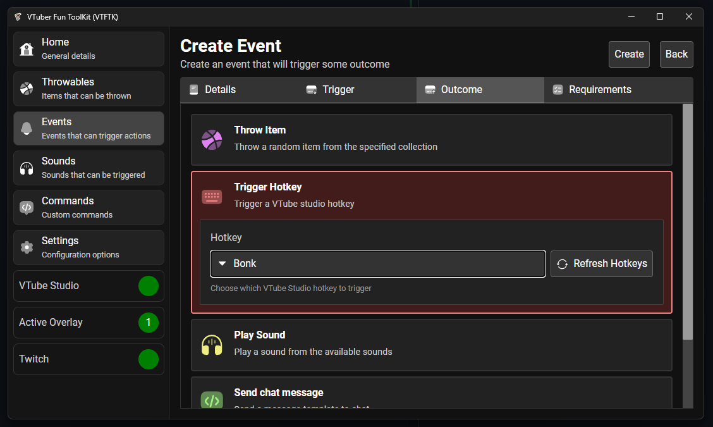
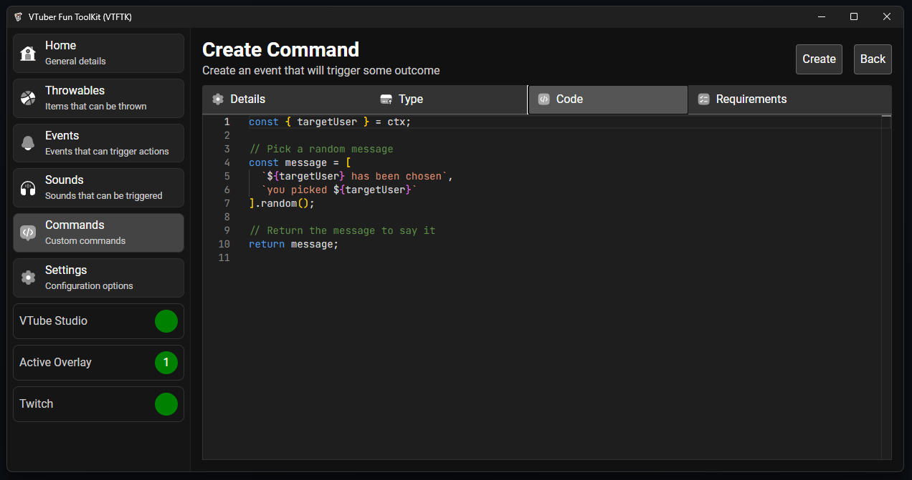
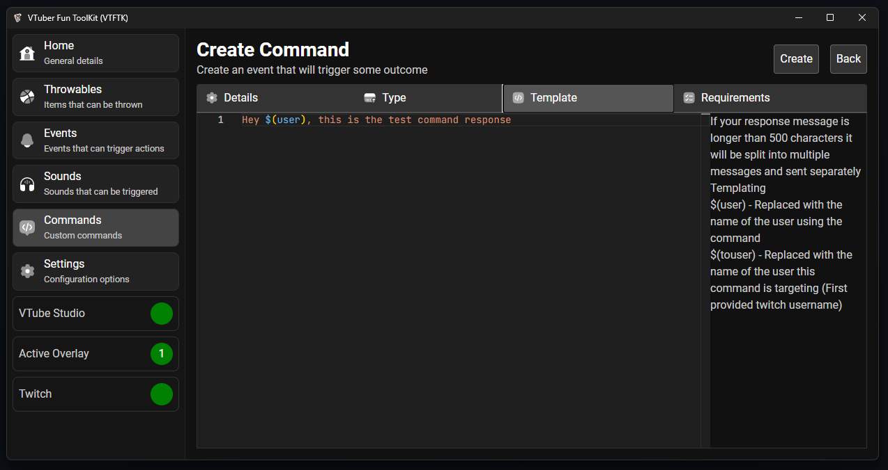
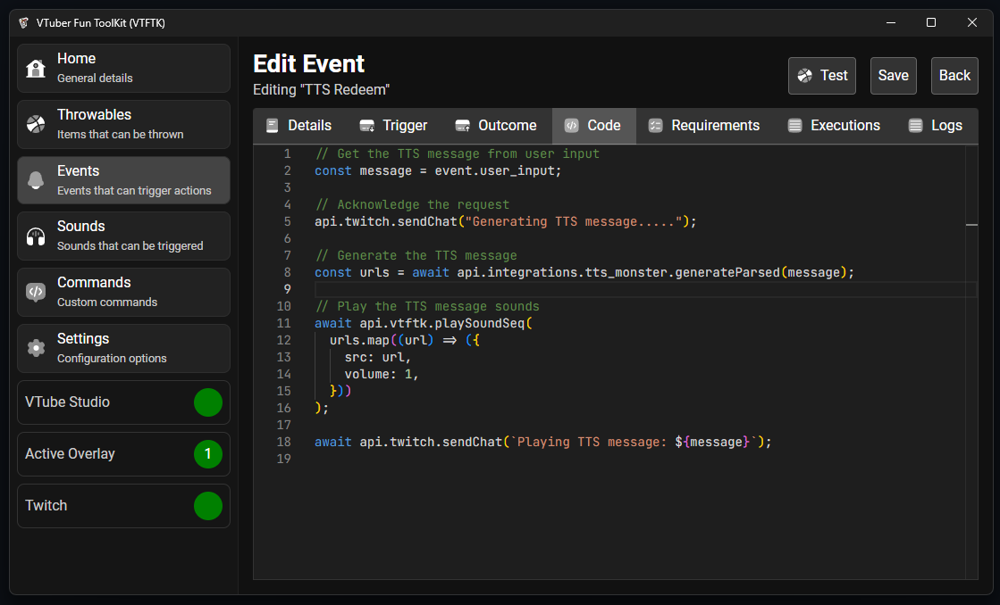

<table>
<tr>
<td> 
</td>
<td>
<h1>VTuber Fun ToolKit (VTFTK)</h1>

App for VTubers to create interactive experiences with their viewers

<a href="https://vtftk.pages.dev/" target="_blank">Website</a>
</td>
</tr>
</table>

##

<table>
<tr>
<td>

</td>
<td>

Checkout the [Website](https://vtftk.pages.dev/) for guides and setup instructions, examples, and documentation for scripting

</td>
</tr>
</table>

## 🎯 Project Overview

This tool allows you to create interactive items that can be thrown at your VTube Studio model, play sounds, trigger VTube Studio hotkeys, and much more with custom scripting. 

Inspired by [KBonk](https://github.com/typeou/karasubonk), this project aims to provide a more tailored and enhanced experience, better suited to my specific needs, preferences, and implementing features that I make use of.

## ⚡ Events

**VTFTK** has a powerful event system that lets you react to "triggers" and produce an "outcome" for various things.

**Triggers:** You can react to these things:  
- 🎉 **Channel Point Redeems** - Run when a channel point redeem is used
- 💬 **Chat Commands** - Run when specific chat commands are used
- ➕ **New Follows** - Run when followers are gained
- ⭐ **Subscriptions** or Gifted Subs - Run when subscriptions are made
- 💎 **Bits Donations** - Run when bits are donated
- 🚀 **Raids** - Run when another Twitch channel raids you
- ⏲️ **Timers** - Run automatically at some fixed time in seconds
- 📢 **Ads Starting** - Run whenever an ad break starts 

**Outcomes:** You can trigger these:  
- 🪶 Throw items at your avatar  
- 🎛️ Activate VTube Studio hotkeys  
- 🔊 Play custom sounds  
- 💬 Send messages in Twitch chat  
- 🖥️ Run custom scripts 

<table>
<tr>
<td>

Triggers

</td>
<td>

    

Outcomes

</td>
</tr>
</table>

## 🛠️ Custom Commands

Create custom commands, using either simple templates or advanced 
custom code to create your own custom experience.

<table>
<tr>
<td>

  

Custom code

</td>
<td>

Simple template

</td>
</tr>
</table>

<table>
<tr>
<td>

 

</td>
<td>

The editor takes advantage of the [Monaco](https://microsoft.github.io/monaco-editor/) to provide a nice editing experience with type hinting right within the editor. See [Scripting](#scripting) for details about scripting itself

</td>
</tr>
</table>

## 💻 Scripting

Powerful built-in scripting using JavaScript, powered by the [Deno Core](https://github.com/denoland/deno_core) runtime using the same performant JavaScript engine used in modern browsers.

Scripting has built in helpers for things such as:

- 🌐 **HTTP Client** – Connect with external APIs to fetch or send data.
- 🎥 **Twitch** – Send chat messages, get user details, and give shoutouts with ease.
- 🗂️ **Key-Value Store** – Save and retrieve data that sticks around even after your stream ends.
- 📊 **Counters** – Keep track of numbers like redeems, subs, or any other countable event.
- 🤖 **TTS Monster** - Use the TTS monster APIs from within scripting to generate and play TTS messages
- 🔊 **Play Sounds** - Play sounds through the overlays both custom sounds and sounds from your list
- 🎯 **Throw Items** - Throw items from your collection of items

## 🔊 Sounds

Play custom sounds for different events, perfect for creating sound alerts! You can also attach sounds to throwable items to play on impact.

## 🤖 TTS Monster Integration

This tool is integrated with TTS Monster to let you use AI-generated text-to-speech voices. Currently, it’s available through the scripting API.

### Example:
With a custom script, users can redeem a "TTS" reward and input a message for the AI to speak aloud!    

## 🧠 Low Resource Usage
The app is built with Rust for efficient performance, and user data is stored in a lightweight SQLite database, ensuring low memory usage.

While the web technologies used for the UI may take up some resources, you can reduce this by closing the VTFTK window. The app will continue running in the background as just the server, removing any unnecessary resource usage from the UI.

You can easily reopen the webview or fully quit VTFTK by clicking the tray menu icon: 

## 🛠️ Built-In Assets

The app includes a collection of pre-configured throwable items from [Pixel Mart](https://ghostpixxells.itch.io/pixel-mart).

Sounds are sourced from [KBonk](https://github.com/typeou/karasubonk) which is originally sourced from [Game Audio GDC](https://sonniss.com/gameaudiogdc) specifically from the [Hong Kong Action Kit Hit Kit 1](http://www.sonniss.com/sound-effects/hong-kong-action-kit-hit-kit-1/) kit

