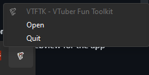

<table>
<tr>
<td> 
</td>
<td>
<h1>VTuber Fun ToolKit (VTFTK)</h1>

<b>WIP</b> App for VTubers to create interactive experiences with their viewers

</td>
</tr>
</table>

## 

Create items that can be thrown at you, sounds that can be played, and trigger VTube studio. All using events from twitch such as redeems, commands, subscriptions, follows, raids, bits

Still early stages and work in progress, but it does work and throwables / sounds can be created then triggered by events.

Aiming to be a tailored and improved version of [KBonk](https://github.com/typeou/karasubonk) more suited to my needs and wants.

## Custom Commands

Write custom commands using JavaScript powered by `deno_core`.  Build in editor running on [Monaco](https://microsoft.github.io/monaco-editor/) providing great editing experience and type hinting for the APIs.

## Sounds 

Sounds, play custom sounds when events occur. Can be used to create sound alerts. Sounds can also be attached to throwable items to
play the sound upon impact

## Scripting 

Subscribe and react to various events using the same JavaScript code powered by the same editor as Custom Commands.

You can listen for events the events below and run code when they happen:

- chat
- cheering bits
- follows
- gifted subscriptions
- resubscription
- redeems
- subscriptions

The [TTS Monster Integration](#tts-monster-integration) section shows some example code for generating TTS messages as the outcome of redeems

## TTS Monster Integration

Integrated with [TTS Monster](https://tts.monster/) to use AI generated text to speech voices. Currently only available through the scripting API

Below is an example script allowing the user to redeem a "TTS" redeem and input a message for the AI TTS to say:

## Low resource usage

Built on Rust for the core logic and storing user data in an SQLite database the app maintains a low memory footprint keeping resource usage as low as possible.

The web technologies used for the UI can take up a bit of resource which is unavoidable. However, to combat this you can close the **VTFTK** window and it will continue to run in the background as just the server, this removes any usage that the Webview for the app
would normally have.

You can then re-open the webview or completely quit **VTFTK** by clicking on the tray menu icon:

## Built-in assets

Collection of built in pre-configured throwable items from [Pixel Mart](https://ghostpixxells.itch.io/pixel-mart)

Sounds sourced from [KBonk](https://github.com/typeou/karasubonk) which is originally sourced from 

[Game Audio GDC](https://sonniss.com/gameaudiogdc) from the [Hong Kong Action Kit Hit Kit 1](http://www.sonniss.com/sound-effects/hong-kong-action-kit-hit-kit-1/)

